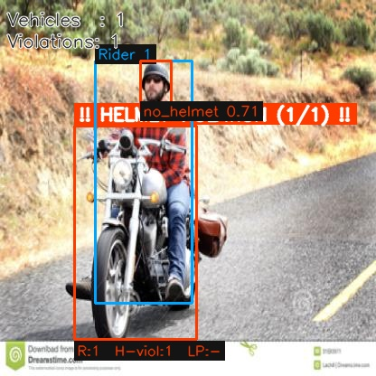
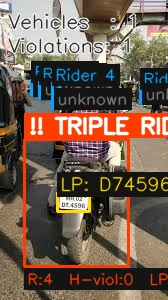

# 🚦 Traffic Rule Violation Detection System (Offline Pipeline)

[](https://www.python.org/)
[](https://pytorch.org/)
[](https://github.com/ultralytics/ultralytics)
[](https://github.com/PaddlePaddle/PaddleOCR)
[](https://opencv.org/)
[](LICENSE)

> *An advanced, fully offline, and modular computer vision pipeline designed to automate traffic enforcement on two-wheelers. It identifies helmet non-compliance, detects triple-riding violations, and extracts license plates under complex, low-light, and steep-angle traffic conditions.*

---

## 📸 Visual Results Showcase

Here are some actual detection and classification outputs generated by our improved pipeline:

### 1. Multi-Vehicle Triple Riding & Helmet Violation Detection
Highly precise tracking of multiple riders and instant detection of helmet infractions combined with license plate extraction:


### 2. High-Accuracy Indian License Plate Capture
Robust identification of standard high-security registration plates (HSRP) with offline OCR character mapping:


### 3. Helmetless Rider Isolation & Annotation
Dynamic overlay classification tracking helmet status in dense environment segments:


### 4. Direct Visual Overlay & Banners
Luminous red warnings indicating `!! HELMET VIOLATION !!` for immediate recognition:


---

## 🎯 Problem Statement

Traffic management authorities globally face massive challenges in enforcing safety compliance for two-wheelers:

### The Enforcement Bottleneck
Manually monitoring CCTV cameras or on-road checkpoints is highly resource-intensive and error-prone. Detecting violations requires checking multiple constraints in real time:
- 🪔 **Helmet Detection** — Checking if every rider on a motorcycle is wearing a helmet.
- 👥 **Rider Count Checking** — Flagging dangerous triple-riding violations (>2 riders).
- 🏷️ **License Plate Extraction** — High-precision plate detection and character transcription (OCR) to enable automated ticketing.

### Key Computer Vision Challenges
❌ **Background Interference**: Pedestrians standing behind motorcycles are often falsely grouped as riders.  
❌ **Head Segmentation Noise**: Standard classifiers struggle when evaluating full-body rider crops due to visual background clutter.  
❌ **Poor Quality License Plates**: Low-contrast, blurry, or angled plates lead to high OCR transcription failures.  
❌ **Character Confusion**: Standard OCR engines frequently confuse digits and letters (e.g., `0` $\leftrightarrow$ `O`, `1` $\leftrightarrow$ `I`, `8` $\leftrightarrow$ `B`) under varying lighting.

---

## ✨ Our Solution: Fully Automated Multi-Stage Computer Vision Pipeline

This system overcomes typical baseline limitations through a state-of-the-art multi-stage pipeline combining **deep learning detection**, **geometric spatial filters**, and a **custom post-OCR text-correction engine**.

### 🚀 Core Capabilities
* **Foot-Zone Spatial Filter**: A pseudo-depth cue that ensures pedestrians/bystanders are only associated as riders if their feet/seating coordinate maps tightly to the motorcycle's bounding box.
* **Outlier Height-Consistency check**: Automatically ignores bystanders by calculating the median height of associated riders and filtering out anomalies.
* **Head-ROI Classification**: Crops the top **42% (Head-Only ROI)** of the rider's crop to run helmet classification, falling back to full-body evaluation only if classification confidence is low.
* **Enhanced License Plate Processing**: Upscales plate crops, applying **CLAHE** (Contrast Limited Adaptive Histogram Equalization) and **unsharp-mask sharpening** to optimize quality before OCR.
* **HSRP Plate Regularization**: Automatically strips out hologram artifacts (like `"IND"` or `"ND"`) and corrects character misidentifications using a position-aware **Character Confusion Matrix** based on the Indian license plate format (`LL DD LL DDDD`).
* **Sideways Plate Fallback**: If standard horizontal OCR fails, the pipeline automatically rotates the crop by 90° clockwise and retries execution.

---

## 🏗️ System Architecture

```
                 ┌────────────────────────────────────────────────┐
                 │                INPUT FRAME/IMAGE               │
                 └───────────────────────┬────────────────────────┘
                                         │
                                         ▼
                 ┌────────────────────────────────────────────────┐
                 │       YOLOv8 VEHICLE & RIDER DETECTOR          │
                 │    Identifies Motorcycles and Person Crops     │
                 └───────────────────────┬────────────────────────┘
                                         │
                                         ▼
                 ┌────────────────────────────────────────────────┐
                 │       CUSTOM NON-MAXIMUM SUPPRESSION (NMS)     │
                 │  Eliminates Heavily Overlapping Vehicle Boxes   │
                 └───────────────────────┬────────────────────────┘
                                         │
                                         ▼
                 ┌────────────────────────────────────────────────┐
                 │     SPATIAL GEOMETRY & CONSISTENCY FILTER      │
                 │   • Foot-Zone Seat Overlaps                    │
                 │   • Outlier Height-Consistency Check           │
                 └──────┬──────────────────────────────────┬──────┘
                        │                                  │
                        ▼ (Rider Head Region)              ▼ (Vehicle Extended Region)
         ┌──────────────────────────────┐          ┌──────────────────────────────┐
         │       HEAD-ROI CROPPING      │          │    LICENSE PLATE DETECTOR    │
         │       Top 42% Head Area      │          │  license-plate-finetune-v1x  │
         └──────────────┬───────────────┘          └──────────────┬───────────────┘
                        │                                  │
                        ▼ (Finetuned YOLOv8)               ▼ (Crop + Pad)
         ┌──────────────────────────────┐          ┌──────────────────────────────┐
         │   HELMET COMPLIANCE ENGINE   │          │      PLATE PRE-PROCESSING    │
         │   Classifies Helmet/No Helmet│          │ CLAHE + Sharpen + Upscaling  │
         └──────────────┬───────────────┘          └──────────────┬───────────────┘
                        │                                  │
                        │                                  ▼ (Offline PaddleOCR)
                        │                          ┌──────────────────────────────┐
                        │                          │   PADDLEOCR INFERENCE ENGINE │
                        │                          │ 90-Deg Rotated Crop Fallback │
                        │                          └──────────────┬───────────────┘
                        │                                  │
                        │                                  ▼ (Format Regularization)
                        │                          ┌──────────────────────────────┐
                        │                          │    POST-OCR RECTIFICATION    │
                        │                          │  Character Confusion Mapping │
                        │                          └──────────────┬───────────────┘
                        │                                  │
                        └────────────────┬─────────────────┘
                                         │
                                         ▼
                 ┌────────────────────────────────────────────────┐
                 │          VIOLATION COMPLIANCE ENGINE           │
                 │   Filters and Maps Violation Output Records    │
                 └───────────────────────┬────────────────────────┘
                                         │
                                         ▼
                 ┌────────────────────────────────────────────────┐
                 │          SPEC-COMPLIANT JSON & EXPORT          │
                 │       Generates Annotated Image & Report       │
                 └────────────────────────────────────────────────┘
```

---

## 🛠️ Technology Stack

| Technology | Purpose | Key Details / Version |
|-----------|---------|-----------------------|
| **Python** | Primary development language | 3.9+ |
| **YOLOv8** | Vehicle, Rider, Helmet, and Plate Detection | Ultralytics Framework |
| **PaddleOCR** | Offline OCR Engine | en_PP-OCRv3_det, en_PP-OCRv4_rec, ch_ppocr_mobile_v2.0_cls |
| **OpenCV** | Image manipulation, CLAHE, sharpening, NMS | cv2 (Open Source Computer Vision) |
| **NumPy** | Mathematical operations and array formatting | Fast geometry mapping |
| **LaTeX** | Academic and technical report compilation | `report.tex` utilizing system assets |

---

## 📂 Project Structure

```
Final_assignment/
│
├── .gitignore                       # Structured Git ignore rules (omits massive weights & envs)
├── README.md                        # Project documentation (You are here!)
├── demo_results/                    # Showcase images (integrated into GitHub)
│   ├── annotated_2.jpg
│   ├── annotated_BikesHelmets122_png.rf.741af70f3f439de00ae9a3603a3eefdc.jpg
│   ├── annotated_Screenshot 2026-05-14 210730.jpg
│   └── annotated_WhatsApp Image 2026-05-14 at 9.40.32 PM.jpg
│
├── new_approach/                    # Optimized Current Production Pipeline
│   ├── solution.py                  # TrafficViolationDetector class (Evaluator entrypoint)
│   ├── run_inference.py             # Visual batch inference pipeline & compliance exporter
│   ├── requirements.txt             # Pinned Python package dependencies
│   ├── report.tex                   # LaTeX source code for the technical project report
│   ├── report_assets/               # Visual graphs, diagrams & success/failure crops
│   └── models/                      # Deep learning model weights directory (kept local)
│
├── baseline_divy_dilksh/            # Production Baseline Pipeline (Divy & Dilksh)
│   ├── solution.py                  # Baseline detection pipeline
│   ├── requirements.txt
│   ├── report.pdf                   # Compiled baseline technical report
│   └── README.md                    # Baseline walkthrough documentation
│
└── baseline_alternative/            # Alternative Baseline Pipeline
    ├── solution.py
    ├── requirements.txt
    └── evaluate.py                  # Local simulator/runner for baseline validation
```

---

## 🚀 Quick Start

### 🔧 Step 1: Environment Setup
It is highly recommended to run this project in an isolated virtual environment using Python 3.9, 3.10, or 3.11:

```bash
# Clone the repository
git clone https://github.com/Divy005/Traffic-Rule-Violation-Detection.git
cd Traffic-Rule-Violation-Detection

# Create a virtual environment
python -m venv .venv

# Activate the virtual environment
# Windows:
.venv\Scripts\activate
# macOS/Linux:
source .venv/bin/activate

# Install required deep learning and processing packages
pip install -r new_approach/requirements.txt
```

---

### 📦 Step 2: Model Weight Installation
To ensure low latency and compatibility with disconnected environments, place all required model weights directly inside the localized `models` directories:

Ensure your `new_approach/models/` folder contains:
1. `yolov8m.pt` or `yolov8s.pt` (Motorcycle + Rider localization)
2. `helmet_best.pt` (Helmet status classification)
3. `license-plate-finetune-v1x.pt` (Plate extraction)
4. `paddleocr_weights/` (Contains PaddleOCR det, rec, and cls inference subfolders)

> **⚠️ NOTE**: By default, `.pt` and `paddleocr_weights/` directories are ignored in `.gitignore` to prevent repository bloat and avoid pushing files larger than GitHub's 100MB threshold.

---

## 📡 API Reference

The `TrafficViolationDetector` is fully self-contained and mirrors standard evaluator protocols.

### Programmatic Usage

```python
from new_approach.solution import TrafficViolationDetector

# Initialize models (automatically locates weights inside searching root paths)
detector = TrafficViolationDetector(model_dir="new_approach/models")

# Run offline prediction on an input image
result = detector.predict("path/to/traffic_frame.jpg")

print(result)
```

### Spec-Compliant Output Format
Only violating vehicles (defined as having `num_riders > 2` or `helmet_violations > 0`) are returned in the output JSON:

```json
{
  "violations": [
    {
      "num_riders": 3,
      "helmet_violations": 2,
      "license_plate": "GJ01AB1234"
    }
  ]
}
```

*Note: If a license plate is detected but could not be reliably parsed via the PaddleOCR engine, `license_plate` defaults to `null`.*

---

## 🤖 Deep Dive: Multi-Stage Processing Pipeline

Our pipeline executes structured geometric and deep learning nodes sequentially to refine data accuracy:

```
┌─────────────────────────────────────────────────────────────┐
│ 1. ENHANCED YOLO DETECTION + LOCAL NMS                      │
│ Runs YOLOv8 to find Motorcycles, Persons, and Plates.       │
│ Implements spatial vehicle-NMS (IoU threshold = 0.50) to     │
│ eliminate overlapping redundant detections.                 │
└────────────────────────┬────────────────────────────────────┘
                         │
                         ▼
┌─────────────────────────────────────────────────────────────┐
│ 2. FOOT-ZONE SEAT FILTERING & HEIGHT CONSISTENCY            │
│ maps the bottom center of each person crop to the vehicle.  │
│ Limits association strictly to the seat/feet area.          │
│ Compares relative heights within the group to remove        │
│ bystander pedestrians (anomaly tolerance < 0.60).           │
└────────────────────────┬────────────────────────────────────┘
                         │
                         ▼
┌─────────────────────────────────────────────────────────────┐
│ 3. HEAD-ROI HELMET CLASSIFICATION                           │
│ Extracts the top 42% of the rider crop (Head ROI).          │
│ Passes Head-crop into 'helmet_best.pt'.                     │
│ Fallback: If no prediction is found, runs on full body crop.│
└────────────────────────┬────────────────────────────────────┘
                         │
                         ▼
┌─────────────────────────────────────────────────────────────┐
│ 4. LICENSE PLATE OVERLAP & OCR PREPROCESSING                │
│ Associates the closest plate bounding box with the vehicle. │
│ Upscales plate crop, applies CLAHE contrast equalization,   │
│ and uses unsharp-mask filtering to optimize readability.     │
└────────────────────────┬────────────────────────────────────┘
                         │
                         ▼
┌─────────────────────────────────────────────────────────────┐
│ 5. RECTIFY CHARACTERS & REMOVE HOLOGRAM ARTIFACTS           │
│ OCR is executed via PaddleOCR.                              │
│ If plate text is short/blurry, retries rotated 90° crop.     │
│ Strips "IND" / "ND" text artifacts.                         │
│ Runs character substitution matrix for HSRP format layout.  │
└─────────────────────────────────────────────────────────────┘
```

---

## 📊 Evaluation & Verification Running

### Running Visual Batch Inference
You can easily process an entire directory of test images, render high-visibility boxes, and export individual compliance JSONs:

```bash
# Run batch inference on test folder
python new_approach/run_inference.py --src test_images/ --out new_approach/output/
```

### Visual Interface Outputs
`run_inference.py` saves richly annotated frames to the output directory:
- **Green Bounding Box**: Fully compliant two-wheeler.
- **Red Bounding Box**: Violating two-wheeler (contains helmet infraction or triple riding).
- **Orange Bounding Box**: Individual riders.
- **Plate cyan tag**: Labeled with transcribed and corrected plate number (e.g. `LP: MH12AB1234`).
- **Violation Banners**: Luminous labels indicating `!! HELMET VIOLATION !!` or `!! TRIPLE RIDING !!` overlayed above the motorcycle.

---

## 👥 Academic Credits & Team

Developed with ❤️ as part of the Semester IV Computer Vision Course.

### Team Members
* **Divy Dobariya** (Roll Number: `BT2024225`)
* **Dilksh Sharma** (Roll Number: `BT2024253`)

---

## 📄 License
This project is licensed under the **MIT License** - see the [LICENSE](LICENSE) file for details.
